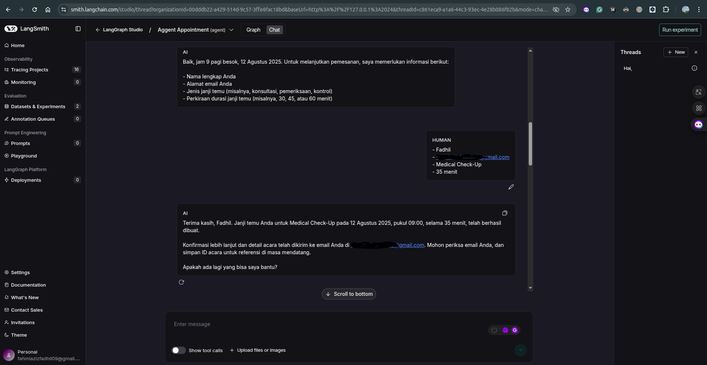

# **SmartClinicAgent**

**Your AI-powered assistant for clinic scheduling & patient communication**

SmartClinicAgent is an **Agentic AI** system designed to help clinics manage appointments, update schedules, and handle cancellations seamlessly.
Integrated with **Google Calendar** and **email services**, it ensures patients and doctors stay in sync effortlessly.

## **✨ Features**

* 📅 **Smart Scheduling** – Book, update, and cancel doctor appointments with ease.
* 🔄 **Google Calendar Integration** – Real-time sync with doctor's availability.
* 📧 **Email Notifications** – Automated reminders and confirmations.
* 🩺 **Doctor Information Lookup** – Retrieve schedules and details without patient data exposure.
* 🤖 **Agentic AI Orchestration** – Uses multiple tools for intelligent workflow automation.

## **🛠 Tech Stack**

* **Python 3.12+**
* **LangChain / LangGraph** – AI orchestration
* **Google Calendar API** – Scheduling integration
* **Gmail SMTP** – Email automation
* **uv** - Python package installer and resolver

## **🚀 Quick Start**
### Prerequisites

- Python 3.10 or higher.
- `uv` for virtual environment management ([Learn more](https://www.datacamp.com/tutorial/python-uv)).

---
### Clone Repository
```bash
git clone https://github.com/fahmiaziz98/SmartClinicAgent.git
cd SmartClinicAgent
```

---
### 1. Create env & activate
```bash
# create venv
uv venv

# activate venv
source .venv/bin/activate

# install dependencies
uv sync
```

---
### 2.Environment Variables
To copy the **.env.example** file to **.env**, you can use the following command in your terminal:
```bash
cp .env.example .env
```

This will create a **.env** file with the same content as **.env.example**. You can then edit the **.env** file to add your actual environment variables.

```env
# api key
GOOGLE_API_KEY=""

# gmail service
ACCOUNT_GMAIL=""
PASSWORD_GMAIL=""

# calendar service
SERVICE_ACCOUNT_FILE="path-service-acount.json"
CALENDAR_ID="you-id-calendar"

# tracing llm
LANGSMITH_TRACING_V2="true"
LANGSMITH_PROJECT="name-project"
LANGSMITH_API_KEY="langsmith-api-key"
```

### 3. Launch LangGraph Server 🚀
```bash
langgraph dev --allow-blocking

# Sample Output
>    Ready!
>
>    - API: [http://localhost:2024](http://localhost:2024/)
>
>    - Docs: http://localhost:2024/docs
>
>    - LangGraph Studio Web UI: https://smith.langchain.com/studio/?baseUrl=http://127.0.0.1:2024
```
**Note:**  
You can try the app at [https://agentchat.vercel.app/](https://agentchat.vercel.app/)  

1. Copy and paste your deployment URL (e.g., `http://localhost:2024`)  
2. Add your Agent **ID**  
3. (Optional) Provide your **LangSmith API Key**  

#### 🖼️ Example UI Screenshot
<div style="margin-bottom: 20px;">
  
</div>


---
## 🚀 Roadmap
- [x] create base `agent-tools`
- [x] Integration `google-calendar`
- [x] Add `memory presistance`
- [x] Sending `email with SMTP` (create-update-deleted)
- [x] Add `rag tools`
- [x] Add `human-interupt (approve/reject)`
- [ ] Add `voice-based using elevenlabs/vapi`
- [ ] Deploy on Docker
- [ ] Deploy on Cloud
- [x] Implement Chat-UI
### Future
- [ ] Implement New Agent Pattern
- [ ] Add Long-Term Memory with `mem0/memU`

---
## 🤝 Contributing

1. Fork the repository.
2. Create a feature branch (`git checkout -b feature/amazing-feature`).
3. Commit your changes (`git commit -m 'Add amazing feature'`).
4. Push to the branch (`git push origin feature/amazing-feature`).
5. Open a Pull Request.

---
## Resources
- [LangChain Gemini](https://python.langchain.com/docs/integrations/chat/google_generative_ai/)
- [CalendarToolkit](https://python.langchain.com/docs/integrations/tools/google_calendar/)
- [Sending GMAIL using SMTP](https://mailtrap.io/blog/python-send-email-gmail/)
- [Integration with Google Calendar](https://medium.com/iceapple-tech-talks/integration-with-google-calendar-api-using-service-account-1471e6e102c8)
- [Langgraph Run a local server](https://langchain-ai.github.io/langgraph/tutorials/langgraph-platform/local-server/)
- [Deploy on Cloud](https://docs.langchain.com/langgraph-platform/deployment-quickstart)

---
## 📄 License

This project is licensed under the MIT License - see the [LICENSE](LICENSE) file for details.

---
## 🆘 Support

- **Issues**: [GitHub Issues](https://github.com/fahmiaziz98/SmartClinicAgent/issues)
- **Email**: [fahmiazizfadhil999@gmail.com](mailto:fahmiazizfadhil999@gmail.com)

---
**Made with ❤️ by fahmiaziz98**
